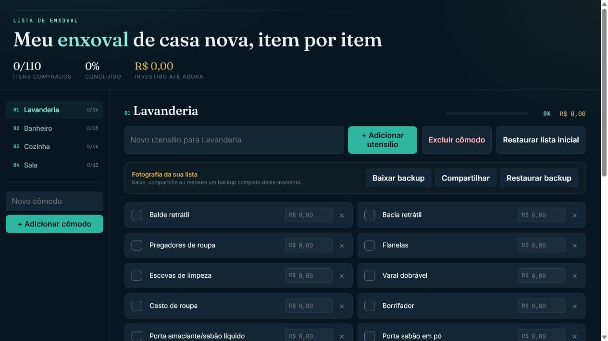

# Meu Enxoval

Uma checklist simples e elegante para organizar as compras do enxoval, acompanhar o progresso de cada cômodo e controlar quanto já foi investido.

[Acessar o site](https://pedro-vaf.github.io/enxoval/)



## Recursos

- Lista organizada por cômodos.
- Marcação dos itens já comprados.
- Registro do preço de cada item.
- Progresso e total investido atualizados automaticamente.
- Criação e exclusão de cômodos e utensílios.
- Salvamento automático no navegador.
- Backup completo em arquivo JSON.
- Compartilhamento do backup por aplicativos compatíveis.
- Restauração da lista a partir de um backup.
- Layout responsivo para computador e celular.

## Backup e restauração

As alterações são salvas no armazenamento local do navegador. Para proteger a lista caso os dados do navegador sejam apagados, a aplicação permite criar uma fotografia do estado atual:

1. Clique em **Baixar backup** para salvar um arquivo JSON.
2. Guarde o arquivo em um local seguro ou envie para seu próprio e-mail usando **Compartilhar**.
3. Quando precisar recuperar a lista, clique em **Restaurar backup** e selecione o arquivo.

Antes de substituir os dados atuais, a aplicação valida o arquivo e solicita confirmação.

## Executar localmente

É necessário ter o [Node.js](https://nodejs.org/) instalado.

```bash
git clone https://github.com/pedro-vaf/enxoval.git
cd enxoval/enxoval-app
npm install
npm run dev
```

O terminal exibirá o endereço local para abrir no navegador.

## Tecnologias

- React
- Vite
- CSS
- LocalStorage
- Web Share API

## Publicação

O projeto é publicado no GitHub Pages por uma rotina automática do GitHub Actions. Cada atualização enviada para a branch `main` gera e publica uma nova versão do site.

Para gerar a versão de produção manualmente:

```bash
cd enxoval-app
npm run build
```

Os arquivos finais serão criados em `enxoval-app/dist`.
